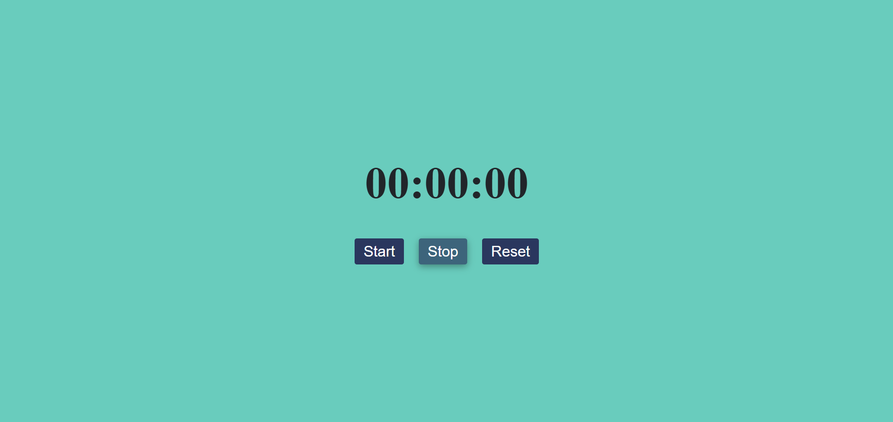

# Stopwatch Project

This is a simple stopwatch app built with HTML, CSS, and JavaScript. It allows users to start, stop, and reset a stopwatch. The app is designed to track time in hours, minutes, seconds, and milliseconds.



## Features

- **Start Button**: Starts the stopwatch.
- **Stop Button**: Stops the stopwatch.
- **Reset Button**: Resets the stopwatch to `00:00:00.00`.

## Demo

You can view the project live [here](#) (if hosted).

## Technologies Used

- HTML5
- CSS3
- JavaScript

## How to Run

1. Clone the repository:
    ```bash
    git clone https://github.com/tkyDevs/stopwatch-project.git
    ```
2. Open the `index.html` file in your browser to start using the stopwatch.

## File Structure
- `index.html`: The structure of the stopwatch.
- `styles.css`: The styles for the stopwatch app.
- `app.js`: The JavaScript that powers the stopwatch functionality.

## How It Works

- The stopwatch displays the time in the format `HH:MM:SS.MS`.
- The JavaScript logic increments the milliseconds every 10ms. When 1000 milliseconds are reached, the seconds increment by 1. When 60 seconds are reached, the minutes increment, and after 60 minutes, the hours will increment.
- The buttons trigger the following actions:
    - **Start**: Starts the timer and changes the button appearance.
    - **Stop**: Stops the timer and changes the button appearance.
    - **Reset**: Resets the timer to `00:00:00.00` and stops the time.

## License

This project is open-source and available under the [MIT License](LICENSE).

